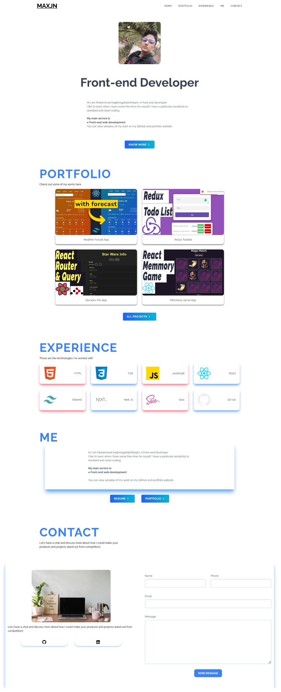

# Next Portfolio

This is a practical [Next.js](https://nextjs.org/) project bootstrapped with [`create-next-app`](https://github.com/vercel/next.js/tree/canary/packages/create-next-app).

See the [Live](https://maxjn-next-portfolio.vercel.app/) project.

## Technologies

- JSX,Materialized Css
- ES6
- React
- **Nextjs**
- **Teact Icons**

## Features

- Mobile First
- Responsive

## Installation

Install **Next Portfolio** with npm

```shell
npm install

npm run dev
```

## Screenshots


